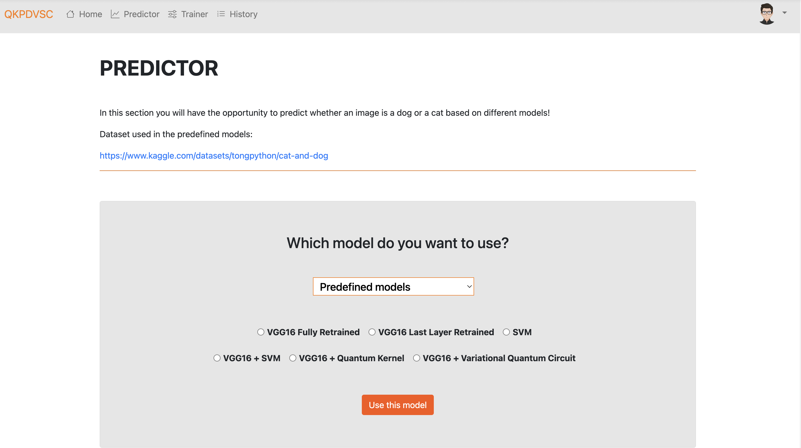
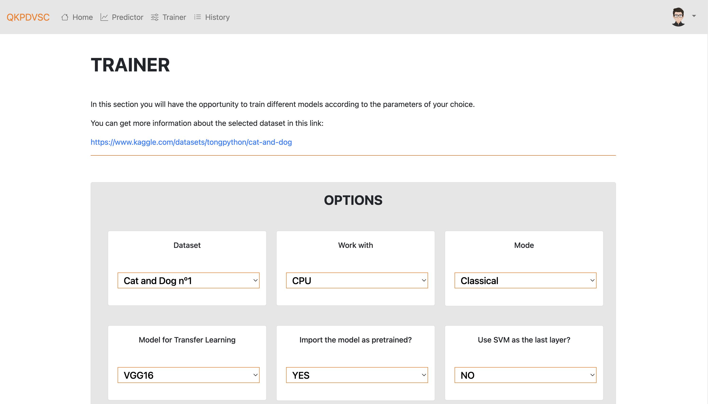

# QuantumKernelsPlayDogsVSCats 🐶🐱🔬

**Final Thesis for the Computer Science degree of Alejandro Argüello Suárez. September 2022****
QuantumKernelsPlayDogsVSCats is a web-based platform that allows users to train and deploy neural networks using various architectures—including classical transfer learning and quantum-enhanced models. The application supports training, prediction, and report generation, making it ideal for users interested in exploring both classical and quantum machine learning techniques.




## Features 🚀

## Features 🚀

- **Hybrid Quantum-Classical Architectures:**  
  Train models using a mix of traditional deep neural networks (e.g., VGG, ResNet) and quantum-enhanced circuits. This hybrid approach leverages quantum computing techniques alongside classical architectures to potentially boost performance on challenging tasks.

- **User Authentication:**  
  Secure login, sign-up, and profile management for personalized usage.

- **Real-time Training Updates:**  
  Monitor training progress and view performance metrics dynamically as the model trains.

- **Flexible Inference and Training:**  
  Users can upload images for inference (e.g., classifying dogs vs. cats) and also train their own neural networks. The app allows users to adjust various training parameters such as learning rate, batch size, optimizer type, and more.

- **Report Generation:**  
  Automatically generate and download PDF reports with detailed model performance metrics.

- **External Model Weights:**  
  Pre-trained model weights are automatically downloaded from Google Drive if they are missing, ensuring that the latest weights are available without bloating the repository.

  
## Prerequisites ⚙️

- Python 3.10 or higher
- [Kaggle API](https://github.com/Kaggle/kaggle-api) (for dataset download)
- A Google Drive account (for hosting model weights)
- Recommended: Conda (for environment management)

## Installation 📦

1. **Clone the Repository:**

   ```bash
   git clone https://github.com/alejandroarguello/QuantumKernelsPlayDogsVSCats.git
   cd QuantumKernelsPlayDogsVSCats

2. Create a Conda Environment (Optional but Recommended):
   ```bash
   conda create -n QuantumKernelsPlayDogsVSCats python=3.10
   conda activate QuantumKernelsPlayDogsVSCats

3. Install dependencies:
   ```
   pip install -r requirements.txt

4. Create a .env file in the project root (this file should be excluded from Git) and add your sensitive credentials, for example:
   ```bash
   EMAIL_ADDRESS='your_email@example.com'
   EMAIL_PASSWORD='your_email_password'
   SMTP_SERVER=smtp.gmail.com
   SMTP_PORT=587

5. (Optional) Download Datasets Automatically:
   The app includes a helper function to download and extract datasets from Kaggle. Ensure you have the Kaggle API configured on your system.


## Usage ▶️
1. Run the app executing the main.py script using your Python intepreter:
   ```
   python main.py

2.	Training a Model:
	•	Navigate to the Trainer section.
	•	Choose your dataset (e.g., one of the “Cat and Dog” options), model architecture, and training parameters.
	•	The app will automatically download the dataset (if not already available) and begin training in a background thread.
	•	Real-time training metrics and performance graphs will be displayed.
3.	Making Predictions:
   •	Navigate to the Predictor section.
   •	Upload an image (e.g., a cat or dog picture).
   •	The app will load the appropriate model weights (downloading them automatically from Google Drive if needed) and display the prediction.
4.	Viewing History and Reports:
   •	In the History section, review previously saved models and generated PDF reports.
   •	Use the provided options to delete records if necessary.

## Example 🎯
Try asking a question like:

	“Explain how backpropagation works in neural networks.”
Or upload an image containing technical diagrams or code snippets to receive a detailed analysis.

## Configuration 🔧

| File      | Purpose |
| ----------- | ----------- |
| main.py      | Entry point for the application       |
| website/__init__.py   | Initializes the Flask app, registers blueprints, and sets up the database        |
| website/models.py   | Contains database models for Users, Saved Models, and PDF Reports       |
| website/auth.py  | Manages user authentication (login, sign-up, forgot password)        |
| website/views.py  | Contains the different functionslities for pages Home, Predictor, Trainer, History, Profile, Admin, etc.        |
| data_setup.py   | Helper module for dataset download/extraction and model weight downloading       |
| .env  | Stores sensitive configuration values (e.g., email credentials, model URLs)       |
| requirements.txt  | Lists all required Python dependencies       |


## Providing Datasets and Model Weights 📥

✅ **Datasets:** &rarr; The app uses the Kaggle API to download datasets automatically if they are not found locally. Users need to have the Kaggle API set up on their system.

✅ **Model Weights:** &rarr; Pre-trained model weights (e.g., for VGG16 Fully Retrained) are hosted on Google Drive. When the app starts, it checks if the required .pth file exists in website/static/additional/predictSectionModels/. If not, it downloads the file automatically using the provided Google Drive URL in your .env.


## Troubleshooting ❌

❌ **Dataset Download Issues:** &rarr; Ensure the Kaggle API is correctly installed and configured, and that your API credentials are set up.

❌ **Model Weights Not Downloading:** &rarr; Verify that the URL in your .env is correct and publicly accessible. Ensure that gdown is installed.

❌ **Port Already in Use:** &rarr; If you receive an error that port 5000 is in use, either terminate the conflicting process or change the port in main.py (e.g., app.run(port=5001)).

❌ **Email Sending Failures:** &rarr; Make sure your email credentials in the .env file are correct and that less-secure app access is enabled (if required) for your email provider.

## More images 📷
